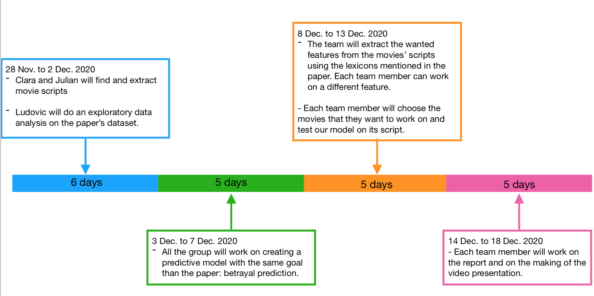

#Important remark
For techical reasons and the sake of clarity, we did the data processing in a separate file ("feature_extraction"). The notebook containing the analysis is "extension.ipynb".

# Project milestone 4

After discussion with our TA, the project described below appeared to be too complex, and not really relevant given the lack of data. Instead, we used another Diplomacy data set by the authors of the "Linguistic harbingers of betrayal" paper, where each message was annotated by the players as lie or truth (intended or perceived); and tried to analyze this new dataset by exploring the same features described in the paper.

# Project milestone 3

## Predicting betrayals in movies

### Abstract
In this project, we want to extend the work of the 'Linguistic harbingers of betrayal' study to another dataset, in another context. We train a model that will predict a betrayal in a relationship, using the dataset from the paper; then test this model on dialogues from famous movies in which a character betrays another and see if the results of the paper apply to movies, or if not, what makes the difference. Betrayals in movies often, if not always, surprise the "victim" character(s), but also the spectator. If the model performs well on the movie scripts, it would be an indicator that it may be relevant to use in other contexts ; if not, it would highlight the difference between a purely textual exchange as in the Diplomacy game, and a more complex situation, including body language, intonations and facial expressions.

### Research Questions
- How different are movie dialogues from Diplomacy messages ?
- Can we train a classifier on a given dataset and obtain relevant results with it on a contextually different dataset ?
- Can we predict betrayal in movies from the lines of the potential betrayer ?

### Proposed dataset
- Dataset from the paper : we use it to train the model, using features from the betrayers' messages.
- Movie scripts (The Lion King, Interstellar, Matrix, Star Wars) : we get from internet, as .txt. We select dialogues between the betrayer and the victim before the betrayal happens, and extract the "messages" from the betrayer, then process the "messages" to obtain the same features used in the model (e.g. politeness score, positivity, etc. depending on which features are selected for the model).

### Methods
Internal milestones :
1) Finding the data : get the movie scripts, extract the relevant lines.
2) Perform an exploratory data analysis on the paper's dataset
3) Create our own predictive model.
4) Processing the new data : extract the appropriate features and prepare a dataframe. We will have to use the lexicons used in the paper to extract the features used in our model.
5) Testing the model : use the model to predict betrayals with the new data and evaluate results.
6) Report : prepare figures and write report or data story.
7) Video : write and make the presentation video.

Timeline :

### Questions for TAs (optional)
We think doing this project with movie scripts would be really interesting and a lot of fun, but maybe it's too complicated and ambitious, in which case, we thought about a "backup" project. Using the dataset from the paper, we could do an exploratory data analysis, looking at the distribution of the different features among the population of betrayers to see if there are different "profiles" of betrayers, and use a clustering method on the messages (maybe do a PCA then use k-means) to try to find different message types, and if certain types are mostly sent by betrayers.
